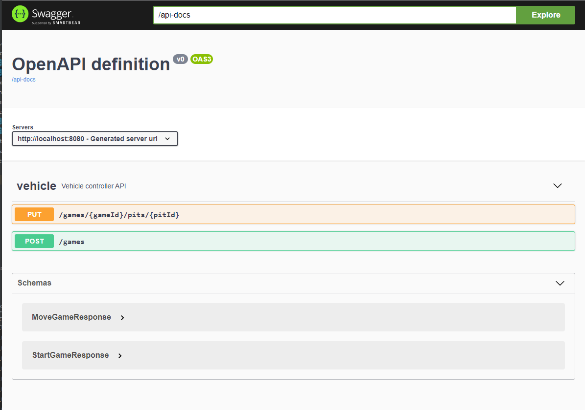
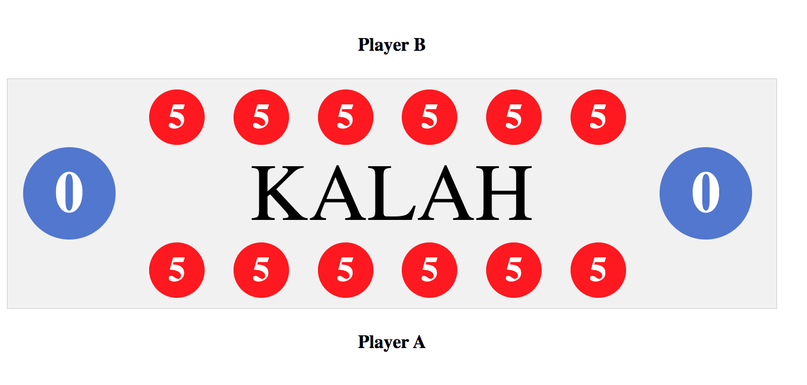
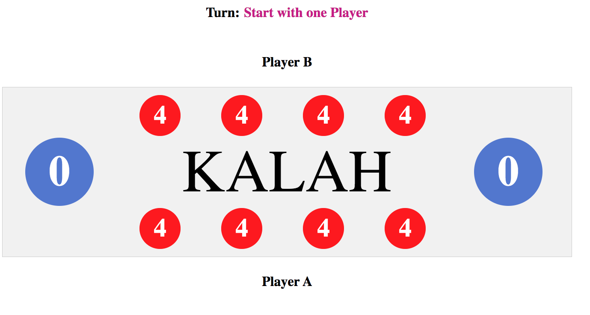
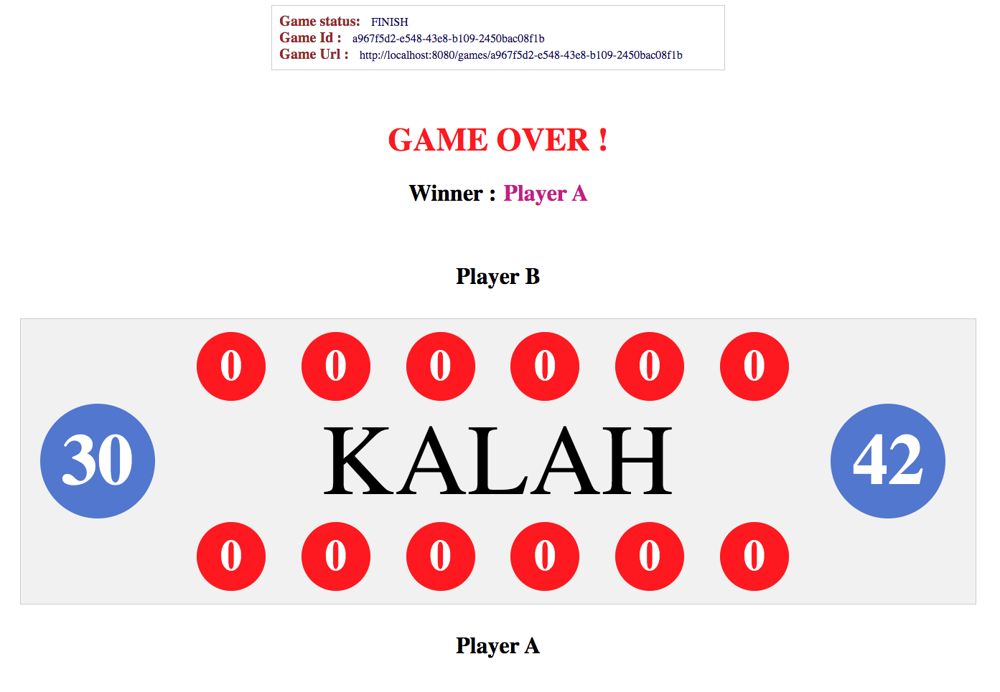
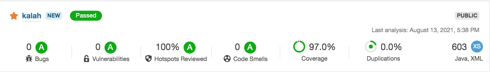
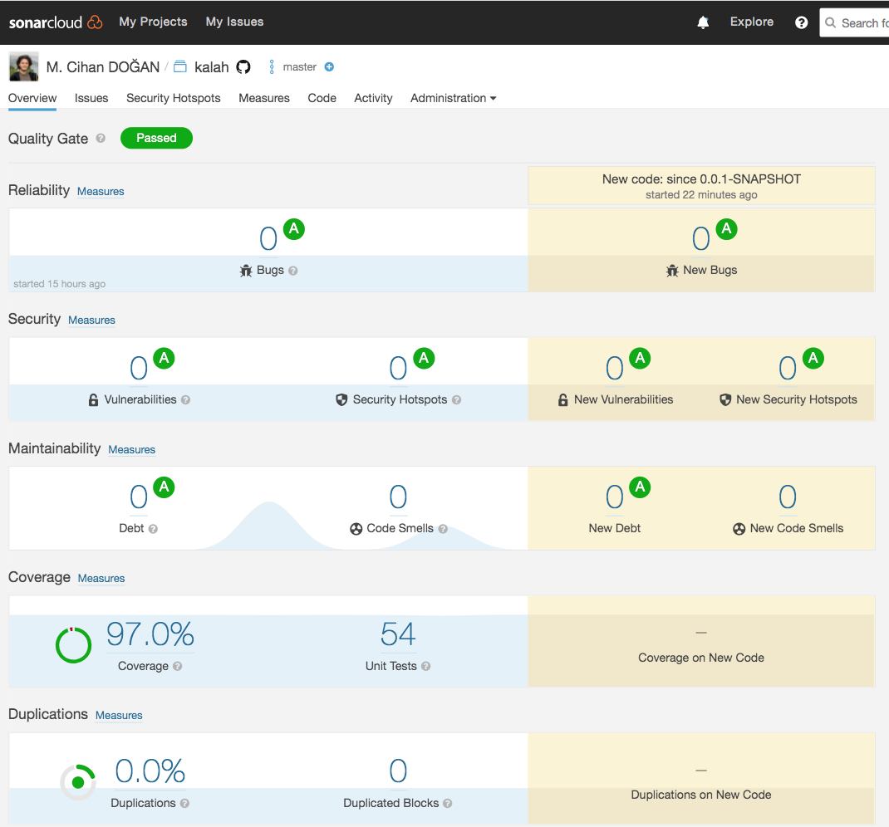

# Kalah Game

[Github Repository](https://github.com/mcihan/kalah)

**@author:** *M. Cihan DOGAN*


This is a SpringBoot + REST API application that runs the game of 6-stone Kalah.   
For the general rules of the game please refer to Wikipedia: https://en.wikipedia.org/wiki/Kalah.  

<br/>

The default implementation of this app for 6 stone and 6 pits.  

**BUT!**
ㅤㅤ
<br/>  

💡 **You can customize the application by changing default stone or pit count. So you can play many different implementation of KALAH**  
```js
Change "DEFAULT_STONE_COUNT" as a N for play N-stone Kalah.     
Change "DEFAULT_PIT_COUNT" as a N for play N-pits Kalah. 
```

## About the game
* Each of the two players has six pits in front of him/her. 
* To the right of the six pits, each player has a larger pit, his Kalah or house.
* At the start of the game, six stones are put In each pit.
* The player who begins picks up all the stones in any of their own pits, and distribute the stones on to the right, one in each of the following pits, including his own Kalah. 
* No stones are put in the opponent(s) Kalah. If the players last stone lands in his own Kalah, he gets another turn. This can be repeated any number of times before it's the other player's turn.

<br/> 

## **Installation**
   
### Minimum Specification
 
 - **Java 11** or latest 


### Build & Run

| | Linux & OSX |Windows|
|--|--|--|
|**Build**|*./mvnw clean install*| *./mvnw.bat clean install*  |
|**Run**| *./mvnw  spring-boot:run*| *./mvnw.bat spring-boot:run*  | 


## **Technology Stack**

| | ㅤName | ㅤVersion|
|--|--|--|
|Software Language| ㅤ**Java SE** | ㅤ11 |
|Framework| ㅤ**Spring Boot**| ㅤ2.5.3 |
|Test|  ㅤ**Spring Boot Test**  <br/>ㅤ├─ Mockito <br/> ㅤ├─ JUnit Jupiter API| ㅤ2.5.3 <br/> ㅤ5.7.2 <br/> ㅤ3.9.0|
|Coverage| ㅤ**JaCoCo** | ㅤ0.8.6 |
|Utility | ㅤ**Lombok**   <br/> ㅤ**Apache Commons Lang3** | ㅤ1.18.20  <br/> ㅤ3.11 |
|UI | ㅤ**Angular**  | ㅤ1.8.2|
 

  


## **API documentation**

You can access the Swagger API documentation using the link below.  
http://localhost:8080/swagger-ui.html  

<br/>

**Swagger Implementation :**  




 

### **How to use API**

1 - Create the game with the command:

```bash
curl --header "Content-Type: application/json" \ 
    --request POST \ 
    http://localhost:8080/games
```

<br/>  

2 - Move the game with the command:

```bash
curl --header "Content-Type: application/json" \
    --request PUT \ 
    http://localhost:8080/games/{gameId}/pits/{pitId}
```
  
  
<br/>

# UI Implementation  

Please browse http://localhost:8080 to play kalah via UI Implementation.  
 
This UI implementation uses the REST API to integrate into the kalah application;

- When you open http://localhost:8080, game start automatically by calling http://localhost:8080/games endpoint  

- When you move stone it call   http://localhost:8080/games/{gameId}/pits/{pitId} and update pits stones.


<br/>

## Default 6-Stone Kalah (6 Stone - 6 Pit)
 
  


## 5-Stone Kalah (6 Stone - 6 Pit) 
  

<br/>

## Custom NxN Kalah (4 Stone - 4 Pit)   


You can play many different implementation of KALAH by changing **DEFAULT_STONE_COUNT** and  **DEFAULT_PIT_COUNT**.  


  


  
<br/>

## Finished Game for (6-stone Kalah)

  


## Code Metrics

  

<br/>

|Metric| Cover persentence|
|-|-|
|Hotspots Reviewed | 100%|
|Test Coverage | 97%|
 

 <br/>

  

 <br/>
 
  ㅤㅤㅤㅤㅤㅤㅤㅤㅤㅤㅤㅤㅤㅤㅤㅤ
