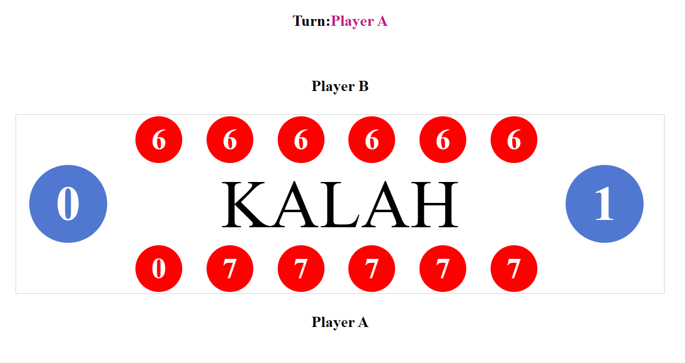
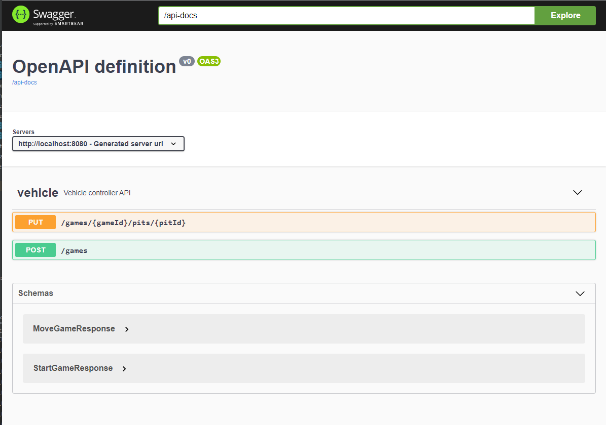

# kalah implementation

https://en.wikipedia.org/wiki/Kalah

## Build

Linux and OSX  
./mvnw clean install

Windows  
./mvnw.bat clean install     

## Run
Linux and OSX  
./mvnw  spring-boot:run

Windows  
./mvnw.bat spring-boot:run

## Play
Either use curl, or hit the local endpoint Swagger harness http://localhost:8080/swagger-ui.html

curl --header "Content-Type: application/json" --request POST http://localhost:8080/games

curl --header "Content-Type: application/json" --request PUT http://localhost:8080/games/{gameId}/pits/{pitId}

 

## Swagger

 

## Usage
Aster running the project it can be used by any rest client or swagger.
You can open Swagger by this link: **http://localhost:8080/swagger-ui.html**

To play two player should enter to game by POST:/games endpoint. Endpoint is returning
GameBean. Save player from returned json. Game can start when there are two entered players.
This is multyplayer, each two players can start the separate game.
**startGame** field is showing whether second player is joined to the game.
If it's **false** call GET:/games endpoint by providing player till the **startGame** field change to **true**.
To play call POST:/games/play by providing player and position in range [0,5].
**myTurn** field is showing weather it's player turn or not. When it's **false** call GET:/GAMES by providing player
till it change to **true**. **finished** field is showing is game finished or not.